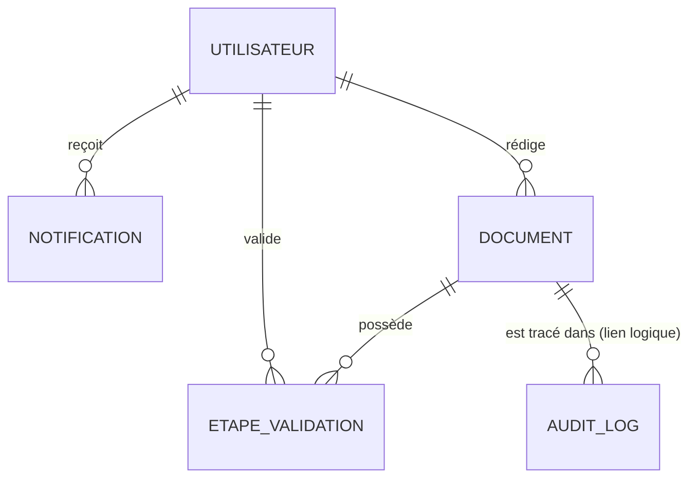

```mermaid
erDiagram
    UTILISATEUR ||--o{ NOTIFICATION : reçoit
    UTILISATEUR ||--o{ DOCUMENT : rédige
    UTILISATEUR ||--o{ ETAPE_VALIDATION : valide
    DOCUMENT ||--o{ ETAPE_VALIDATION : possède
    DOCUMENT ||--o{ AUDIT_LOG : "est tracé dans (lien logique)"

```